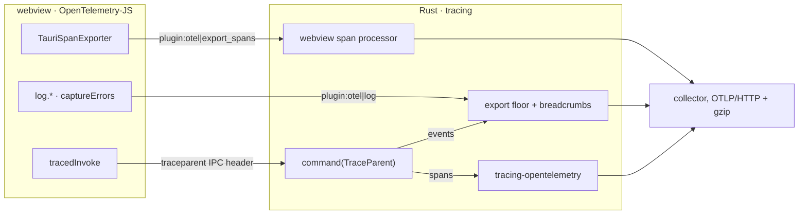

# tauri-plugin-otel

OpenTelemetry for Tauri v2. Traces and logs go over OTLP/HTTP from the Rust side
**and** the webview, under one resource and behind one export floor.



The page never talks to the collector. Everything leaves through the Rust
side's exporters, so there is no CORS to configure on the collector, no second
identity to keep in step, and one floor over both halves of the app.

## Why this exists

Before writing it, we looked for a plugin that already did this (2026-09-24,
crates.io and npm):

| candidate                                                                         | what it is                                                                                      | why it was not enough                                                                                                                                                                                            |
| --------------------------------------------------------------------------------- | ----------------------------------------------------------------------------------------------- | ---------------------------------------------------------------------------------------------------------------------------------------------------------------------------------------------------------------- |
| [`tauri-plugin-tracing`](https://github.com/fltsci/tauri-plugin-tracing) 0.3.4    | a `tracing` subscriber for Tauri: console, file and webview log targets, JS→Rust log forwarding | OpenTelemetry is only "bring your own layer". No OTLP export, no webview spans, no trace context across `invoke`, no resource identity, no export floor. Its platform table marks only macOS as fully supported. |
| [`tauri-plugin-auditaur`](https://github.com/sethjuarez/auditaur) 0.4.7           | development-time telemetry into a local SQLite store, read by a CLI and an MCP server           | Built for development, not for shipping. No OTLP export (listed as "planned").                                                                                                                                   |
| [`tauri-plugin-sentry`](https://github.com/timfish/sentry-tauri) 0.6.0            | Sentry for Tauri                                                                                | Sentry's protocol, not OpenTelemetry's.                                                                                                                                                                          |
| `tauri-plugin-telemetry`, `tauri-plugin-tauri-watch`, `tauri-plugin-posthog-anon` | product analytics                                                                               | Events for analytics backends, not traces or logs.                                                                                                                                                               |

None exports OTLP from both halves of the app with trace context across the IPC.
So this plugin does that, and nothing else.

## What it does

1. **At setup** it builds the OTLP/HTTP exporters and installs the global
   `tracing` subscriber. Every `tracing` span becomes an OpenTelemetry span.
   Every event becomes a log record offered to the export floor.
2. **The webview's spans** (OpenTelemetry-JS, through `TauriSpanExporter`) and
   **log records** (`log.*`, `captureErrors`) cross the IPC and leave through
   the same exporters, re-stamped with the app's resource.
3. **A webview call made with `tracedInvoke`** carries its span as a
   `traceparent` IPC header. A command that takes a `TraceParent` argument
   continues the same trace.
4. **On `RunEvent::Exit`** everything batched is flushed. Each pipeline gets at
   most one second, so a collector that has gone quiet cannot stop the app
   from closing.

**Instrumentation is never in the functional path.** Nothing here can fail the
app. A missing endpoint, a malformed one, and an exporter that will not build
all end in `Status::LocalOnly`. A collector that is unreachable at export time
costs a background thread a timeout and nothing else. No guest function throws
into the page.

## Installing

Consumed by git ref, like the organisation's other Tauri plugins. Pin a tag, so
the crate and the JS package always come from the same release.

```toml
# src-tauri/Cargo.toml
[dependencies]
tauri-plugin-otel = { git = "https://github.com/vaam-apps/tauri-otel", tag = "v0.1.0" }
```

```jsonc
// package.json
"dependencies": {
  "tauri-plugin-otel-api": "github:vaam-apps/tauri-otel#v0.1.0",
  "@opentelemetry/api": "^1.9.0"
}
```

The JS package builds itself on install (`prepare`), so `dist-js/` is never committed.

Allow the webview to call the plugin in a capability:

```json
{ "identifier": "main", "windows": ["main"], "permissions": ["otel:default"] }
```

`otel:default` allows `log` and `export_spans`. An app that does not instrument
its frontend should leave it out rather than narrow it.

## Usage

### Rust

```rust
fn main() {
    tauri::Builder::default()
        .plugin(
            tauri_plugin_otel::Builder::new("vaam-vendor", "production")
                .endpoint("https://otel.vaam.store")
                .build_id(env!("BUILD_ID")) // e.g. "1.4.2+812", stamped by CI
                .filter("info,vaam_app_core=debug")
                .build(),
        )
        .run(tauri::generate_context!())
        .expect("error while running tauri application");
}
```

| builder method                                   | default                   | what it decides                                                                             |
| ------------------------------------------------ | ------------------------- | ------------------------------------------------------------------------------------------- |
| `new(service_name, deployment_environment_name)` | **required**              | `service.name` and `deployment.environment.name`                                            |
| `endpoint(url)`                                  | none: nothing is exported | the collector's base URL; `/v1/traces` and `/v1/logs` are appended                          |
| `export_floor(level)`                            | `WARN`                    | the least severe log record exported on its own                                             |
| `breadcrumbs(n)`                                 | `12`                      | how many withheld records an `ERROR` carries; `0` turns them off                            |
| `filter(directives)`                             | `info`                    | which spans and events reach the subscriber at all (`EnvFilter` syntax)                     |
| `span_level(level)`                              | `INFO`                    | the least severe `tracing` span that is exported                                            |
| `sample_ratio(r)`                                | `1.0`                     | head sampling, parent-based                                                                 |
| `build_id(id)`                                   | none                      | `app.build_id`                                                                              |
| `resource_attribute(kv)`                         | none                      | any other resource attribute; wins over detection                                           |
| `header(name, value)`                            | none                      | sent with every export. Compiled into the binary, so it is an ingestion key, never a secret |
| `timeout(d)`                                     | 10 s                      | one export's budget                                                                         |
| `console(bool)`                                  | debug builds only         | also print to stderr                                                                        |

A command that should continue the webview's trace takes a `TraceParent`, and
hands it the span **before the span is entered**:

```rust
use tauri_plugin_otel::TraceParent;
use tracing::Instrument as _;

#[tauri::command]
async fn save_listing(parent: TraceParent, draft: Draft) -> Result<(), String> {
    let span = parent.parent_of(tracing::info_span!("save_listing"));
    async move { /* … */ }.instrument(span).await
}
```

Not `#[tracing::instrument]` with a call inside the body. In
`tracing-opentelemetry` 0.34, entering a span starts its OpenTelemetry half, and
a started span's parent can no longer change, so by the time the body runs the
call is silently ignored. `propagation::tests::a_span_already_entered_cannot_be_reparented`
pins that behaviour, so an upgrade that lifts it gets noticed.

`app.otel()` (`OtelExt`) gives the pipeline: `status()`, `is_exporting()`,
`flush()`, `shutdown()`, and `tracer_provider()` for code that wants an
OpenTelemetry tracer directly. The plugin also registers the provider and the
W3C propagator globally, so `opentelemetry::global` works as usual.

### TypeScript

```ts
import { BatchSpanProcessor, WebTracerProvider } from '@opentelemetry/sdk-trace-web'
import { TauriSpanExporter, captureErrors, log, tracedInvoke } from 'tauri-plugin-otel-api'

const provider = new WebTracerProvider({
  spanProcessors: [new BatchSpanProcessor(new TauriSpanExporter())],
})
provider.register()
captureErrors()

log.info('listing editor opened', { listing: id })   // withheld unless an error follows
await tracedInvoke('save_listing', { draft })         // one trace, page to Rust
```

| export                                                    | what it is                                                                                                              |
| --------------------------------------------------------- | ----------------------------------------------------------------------------------------------------------------------- |
| `TauriSpanExporter`                                       | an OpenTelemetry-JS `SpanExporter` that sends finished spans over the IPC. The provider's own resource is ignored       |
| `log.{trace,debug,info,warn,error}(message, attributes?)` | a log record through the export floor, carrying the active span. Records written in one task leave in one IPC call      |
| `captureErrors(target = window)`                          | uncaught errors and unhandled rejections as `error` records with `exception.*`. Returns the uninstaller                 |
| `tracedInvoke(cmd, args?, options?)`                      | `invoke` in a `CLIENT` span, with the span sent as `traceparent`. A rejection marks the span and is re-thrown unchanged |
| `traceHeaders()`, `withTraceparent(headers)`              | the same header, for calling `invoke` yourself                                                                          |
| `flushLogs()`, `available()`                              | send queued records now; whether the page is in Tauri at all                                                            |

Outside Tauri, in a plain browser during development, every function is a quiet
no-op. When the plugin is present but unreachable (no capability, for example),
the first failure prints one `console.warn`.

## The identity a build reports under

| attribute                                       | from                                                                                                           |
| ----------------------------------------------- | -------------------------------------------------------------------------------------------------------------- |
| `service.name`                                  | `Builder::new`, required                                                                                       |
| `deployment.environment.name`                   | `Builder::new`, required. The stable key; the deprecated `deployment.environment` is never sent                |
| `service.version`                               | the **installed artifact**: Tauri's `PackageInfo`, i.e. `tauri.conf.json`'s `version` compiled into the binary |
| `app.build_id`                                  | `Builder::build_id`, when given                                                                                |
| `service.instance.id`                           | random per process                                                                                             |
| `os.type`, `os.name`, `os.version`, `host.arch` | the platform, in the semantic conventions' own spelling (`darwin` for macOS and iOS, `amd64`/`arm64`)          |
| `telemetry.distro.*`, `telemetry.sdk.*`         | this plugin, and the SDK underneath it                                                                         |

Two things are deliberately not defaulted. A silent default is how a build comes
to report the wrong identity without anyone noticing.

## The export floor and breadcrumbs

Every log record, from Rust or from the page, passes through one floor. A record
at or above it is exported. A record below it is **withheld** in a short ring,
and sent only if an `ERROR` follows while it is still there. It goes as one extra
`breadcrumbs` record, emitted just before the fault, carrying lines like
`-0.412s INFO webview: listing editor opened`.

- **A `WARN` gets no trail.** An expected condition is not something anyone
  opens a stack trace for.
- **A trail is spent once it is sent.** A second error a moment later does not
  resend the first one's context.
- **With nothing withheld, there is no trail.** It would duplicate records
  already sent.
- **A withheld record is never exported on its own later.** It rides with a
  fault or it never leaves.
- **Events inside a span are held to the same floor.** `tracing-opentelemetry`
  turns them into span events, and without the floor every `debug!` in a command
  would reach the collector through the trace instead.
- **One `WARN` per launch** names the service, version, environment, endpoint
  and floor. At the default floor an `INFO` would be withheld, and a quiet build
  could not tell you why it is quiet.

The design comes from a mobile client in this organisation that measured its own
stream: 96.5% of what it shipped was debug and info chatter, one record per
navigation and per state change. That costs the radio on every interaction and
buys an operator nothing. With breadcrumbs, the context an error needs survives
the cut, and volume scales with faults rather than with use.

## Design notes

### Why webview spans keep their own ids

A webview span arrives finished, and its children may arrive in a later batch
naming it as their parent by id. `opentelemetry_sdk` 0.33's tracer always mints
its own ids (`Tracer::build_with_context`), so re-creating the span through it
would orphan every child. Webview spans therefore go straight to a dedicated
`BatchSpanProcessor` as `SpanData`, with the page's ids kept exactly.

### Why the traceparent header is a plain object

On Android, Tauri never uses the custom-protocol IPC. Every call goes through
`postMessage`, which JSON-serialises `invoke`'s options, and
`JSON.stringify(new Headers(...))` is `{}`. A `Headers` instance would carry the
trace on every platform but one (`tauri` 2.11, `scripts/ipc-protocol.js`).
`withTraceparent` always returns a plain object, and a test round-trips it
through JSON.

### Why TLS uses bundled roots

`reqwest` 0.13's default rustls roots go through `rustls-platform-verifier`. On
Android that panics inside the handshake unless a JNI hook ran first. An app that
gets the hook wrong must still be able to report it, so the telemetry client
trusts the bundled Mozilla roots (`webpki-roots`) and uses the `ring` provider
explicitly. It never installs a process-wide crypto provider on the app's behalf.
The cost: a collector behind a private or interception CA is not trusted.

### Why the HTTP client is blocking

`opentelemetry_sdk`'s batch processors run on their own OS threads and drive each
export with `futures_executor::block_on`, which gives an async client no reactor.
The client is built on a thread of its own, because `reqwest::blocking` refuses
to be constructed inside a tokio runtime.

### What it does not do

- **Metrics.** A metric reader exports on a timer whether or not anything
  happened, which on a metered connection is a cost with no event behind it.
  Adding them is a code change and a review, not a flag.
- **Offline buffering.** A batch that cannot be sent is dropped after its
  timeout; nothing is written to disk and replayed. An app that needs its
  telemetry to survive a week offline needs a store-and-forward exporter, which
  this is not.
- **Configuration from the environment.** `OTEL_EXPORTER_OTLP_ENDPOINT` and
  friends are an operator's knobs on a server. On an end user's machine they
  would be a stranger's, so every setting here is explicit in code.
- **Instrument `invoke` automatically.** Tauri's generated handlers spawn async
  commands onto their own tasks, so a span entered around dispatch would not
  cover the command's work. Continuing a trace is one explicit argument instead.

## Verification

```bash
cargo fmt --check && cargo clippy --all-targets -- -D warnings && cargo test
npm ci && npm run typecheck && npm test && npm run build
```

- **`tests/end_to_end.rs`** runs a mock Tauri app with the plugin. The app's ACL
  is resolved from this crate's real `permissions/` and one capability, exactly
  as `tauri-build` resolves it, so a permission missing from `default.toml`
  fails here. The test exports to a loopback OTLP/HTTP receiver, un-gzips and
  decodes the protobuf that actually arrived, and asserts:
  - the command's span continues the page's trace;
  - the page's span keeps its id;
  - a malformed span is dropped and counted;
  - both carry one resource;
  - the command's `INFO` stayed home until its `ERROR`, then arrived as the
    breadcrumb record just before it;
  - the page's `DEBUG` stayed home, and its `WARN` left attached to its span.
- **`fixtures/wire-span.json`** is read by both `src/webview.rs`'s tests and
  `guest-js/wire.test.ts`. The TypeScript producer and the Rust consumer cannot
  drift apart without one suite going red.
- **`pipeline::tests::shutdown_against_a_silent_collector_is_bounded`** holds
  connections open and never answers. Shutdown takes about two seconds. With the
  bounded shutdown replaced by a plain `shutdown()`, the same test fails at 10.0
  seconds, which was checked by hand when it was written.
- **CI** runs the Rust suite on Linux, Windows and macOS. It builds and lints
  the whole crate for Android against the runner's NDK, and checks iOS.

## Licence

MIT. See `LICENSE`.
